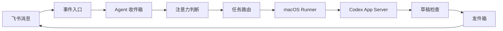

# Lark Agent

Lark Agent 是一个自托管的飞书消息 Agent 控制面。它通过飞书长连接接收消息，把信号送入 Agent 收件箱，再由固定绑定 `CODEX_HOME + profile` 的 macOS Runner 调用 Codex App Server 完成任务，并把回复发送回原私聊或群聊主消息流。

项目包含：

- Fastify + PostgreSQL 控制面，不依赖 Redis。
- React 运维后台，可查看消息、Signal、注意力判断、Codex、草稿和发件箱的完整数据流。
- 基于 `lark-cli event consume` 的飞书长连接，不要求公网事件回调地址。
- 动态管理多个飞书机器人，每个机器人使用独立凭据、消费者、角色和群绑定；每个机器人加聊天永久绑定独立 Codex Thread。
- GitLab Runner 式的一次性设备注册，以及相互独立的 macOS `launchd` Worker 与设备管理进程。
- 每个 Runner 固定绑定 Codex Home、profile 和一个或多个总工作区；每个聊天自动使用 `<总工作区>/<App ID>/chats/<Chat Context UUID>/` 专属子目录，任务不会静默迁移或跨聊天共享工作目录。
- CardKit 单消息流式回复、草稿新鲜度检查、幂等发件箱和故障诊断。
- 机器人级与聊天 Thread 级 SkillHub 技能、Runner 用户技能盘点，以及加密运行依赖下发。

## 架构



## 要求

- Node.js 22 或更高版本，pnpm 11。
- Docker 与 Docker Compose。
- 飞书自建应用及 Bot 凭据。
- 运行 Runner 的 macOS，已安装并配置 Codex CLI。
- 可供目标 Mac 下载 Runner 产物的 HTTP(S) 地址。

## 本地启动

```bash
cp .env.example .env
pnpm install
pnpm build
docker compose up -d postgres control
```

如需由 Compose 暴露控制面端口：

```bash
docker compose -f compose.yaml -f compose.host.yaml up -d postgres control
```

控制台支持挂载在 HTTPS 子路径。将 `ADMIN_ORIGIN` 设置为完整公开地址（例如
`https://agent.example.internal/lark-agent`），并让反向代理把该路径前缀剥离后转发到 control；
同时传递 `X-Forwarded-Prefix: /lark-agent`。后台静态资源、API、SSE、身份确认链接和
Session Cookie 会保持在同一子路径内。

如需同时运行示例 Caddy 入口：

```bash
docker compose --profile proxy up -d
```

首次启用飞书前，使用 App Secret 初始化独立的 `lark-cli` volume：

```bash
pnpm init:lark-volume
```

该脚本只在初始化阶段读取 `.env` 中的 `BOT_APP_SECRET`。导入成功后可从私有 `.env` 删除
`OWNER_OPEN_ID`、`BOT_APP_ID`、`BOT_APP_SECRET` 和 `WHITELIST_CHAT_IDS`；机器人、主人及群绑定
以后以 PostgreSQL 和 lark-cli profile 为准，长期运行的 `control` 容器不接收 App Secret。

## 飞书配置

至少订阅 `im.message.receive_v1`。控制台添加机器人时会自动读取应用当前实际授权，并检查以下完整能力；已有机器人也可以在“机器人”页面随时重新检测：

- 私聊消息：`im:message.p2p_msg:readonly`
- 群内用户 @：`im:message.group_at_msg:readonly`
- 群内普通用户消息：`im:message.group_msg`
- 用户或机器人 @：`im:message.group_at_msg.include_bot:readonly`
- 群内机器人普通消息：`im:message.group_bot_msg:readonly`
- 消息读取与发送：`im:message`
- 群聊信息读取：`im:chat:read`、`im:chat:readonly` 或 `im:chat` 其中之一
- CardKit 单消息流式回复：`cardkit:card:write`

部分能力兼容飞书历史权限名称或拆分权限组合，控制台会自动识别。权限开通后必须发布新的应用版本，再点击“重新检测”。凭据有效、应用权限完整和 `im.message.receive_v1` 事件长连接正常是三个独立状态；新机器人权限不完整时会保留配置但暂不启用。卡片按钮回调是可选能力，可通过 `LARK_CARD_ACTIONS_ENABLED` 单独启用。

Agent 支持飞书直接图片、直接文件，以及富文本消息中的图片和文件；暂不读取音频、视频与贴纸。私聊附件可以直接触发任务；群聊第一次激活仍需 `@` 机器人，已激活会话中的后续附件可以直接进入收件箱。附件下载复用已有 `im:message` 权限，不需要新增授权。

单个附件默认上限为 100MB，单任务去重后的附件总量默认上限为 200MB。下载失败、资源已删除或超限时，其他文本和附件仍会继续处理，任务时间线会记录不可用原因。Runner 将附件原子写入聊天专属工作区的 `.lark-agent/attachments/<message-id>/`，目录权限为 `0700`、文件权限为 `0600`，默认保留 7 天；附件内容不写入 PostgreSQL。相关配置为：

```text
ATTACHMENT_MAX_BYTES=104857600
ATTACHMENT_TASK_MAX_BYTES=209715200
ATTACHMENT_RETENTION_DAYS=7
```

私聊机器人发送：

```text
/帮助
/连接控制台
```

`/连接控制台` 会返回一条两分钟有效、只能使用一次的身份确认链接。后台只接受已在机器人配置中绑定为主人的飞书身份；`OWNER_OPEN_ID` 只用于空数据库首次引导。

## 添加和绑定机器人

首次启动会把 `.env` 与默认 `lark-cli` 身份导入为第一个机器人。之后在 HTTPS 控制台的
“机器人”页面添加其他飞书应用：App Secret 只写入服务器上权限为 `600` 的独立
`lark-cli` profile，不进入 PostgreSQL、API 响应或日志。添加后私聊对应机器人发送控制台生成的：

```text
/绑定控制台 <一次性代码>
```

再勾选该机器人可以处理的群，并按需设置角色提示词、默认执行器和默认总工作区。Runner 会在每个聊天首次执行任务时创建 `<总工作区>/<App ID>/chats/<Chat Context UUID>/`，并将它作为该聊天独立的 Codex 工作目录。同群的不同机器人会使用不同 Context 与目录。群中明确
`@` 某个已注册机器人时只路由给被提及者；没有明确提及机器人的普通续聊会进入该群
所有活跃机器人各自的收件箱，由它们独立决定是否响应。已注册机器人的最终回复也通过飞书原生消息事件按普通成员消息进入其他活跃机器人的收件箱；不会回灌给自己，也不会传播 commentary、审批或故障提示。该能力依赖 `im:message.group_at_msg.include_bot:readonly` 和 `im:message.group_bot_msg:readonly`，不使用控制面内部投递。

“机器人”页面可配置连续互聊的全局因果深度，默认 30 轮、范围 1–200。达到上限时当前回复仍会发送，但控制面停止继续传播，只在群内提示一次并等待人类消息；下一条人类消息会自动建立新的因果起点。角色与路由修改只影响新会话。

## 添加 Runner

在后台“执行器”页面生成一次性安装指令。指令会包含控制面地址、十分钟有效的注册令牌和 Runner 产物地址：

```bash
curl -fsSL 'https://cdn.example.com/lark-agent/runner/install.sh' \
  | /bin/zsh -s -- \
    --artifact-base 'https://cdn.example.com/lark-agent' \
    --server 'https://agent.example.com' \
    --token '<one-time-token>'
```

安装器支持 macOS Apple Silicon 和 Intel，默认发现 `~/.codex`，优先选择 `he` profile，并将当前目录作为第一个总工作区。机器人任务不会直接在总工作区根目录执行，而是在 App ID 下各自的聊天 Context 子目录中运行。安装后使用：

```bash
lark-agent-runner help
lark-agent-runner status <executor-id>
lark-agent-runner stop <executor-id>
lark-agent-runner start <executor-id>
lark-agent-runner logs <executor-id>
```

Runner 安装在 `~/Library/Application Support/Lark Agent Runner/`，设备凭据只保存在目标 Mac，控制面只保存哈希。

新版 Runner 还会安装独立常驻的设备管理进程。后台“设备端管理”可直接执行状态、启动、停止、重启、有限日志和 Profile 切换，不再要求登录目标 Mac 输入命令。Profile 切换会等待当前任务安全结束、刷新所有绑定聊天的 Thread 快照、为每个聊天创建新 Thread 并导入结构化摘要；全部成功后才一次性更新聊天绑定，失败则恢复原 Profile。已有设备升级到包含管理进程的版本时仍需最后执行一次本机升级命令，之后均可远程管理。

## SkillHub 技能与运行依赖

后台可以通过 `@namespace/slug`（例如 `@sh01/git-commit`）为机器人添加多个 SkillHub 技能。技能可以作用于该机器人的所有聊天，也可以只作用于一个已有聊天记忆；每次添加固定当时解析到的版本，升级需要主人显式操作。Runner 自身 `$HOME/.agents/skills` 中已启用的用户级技能会一并展示，但始终只读。

控制面负责访问 SkillHub、校验并缓存技能包，生产环境需要配置：

```text
SKILLHUB_REGISTRY_URL=https://skillhub.example.internal
SKILLHUB_API_TOKEN=<token>
SKILL_RUNTIME_ENCRYPTION_KEYS=v1:<base64-32-byte-key>
SKILL_RUNTIME_ACTIVE_KEY_ID=v1
```

每个受控技能可以保存环境变量，或把 `.env`、JSON、YAML、TOML、PEM 等 UTF-8 文本配置持续同步到聊天专属工作区。数据库只保存 AES-256-GCM 密文；环境变量仅在对应正式任务的短生命周期 Codex App Server 中出现。工作区文件以 `0600` 权限落盘，后台记录并展示期望版本、最近一次实际 SHA-256、漂移、更新和删除状态。全局技能可以提供默认配置，特定 Thread 可以逐项覆盖。

敏感值写入后不可从后台回读或下载，只能覆盖或删除。工作区配置文件为了满足技能运行会以明文持续存在，因此只应把技能授权给可信机器人和聊天；文件漂移或目标冲突时系统不会静默覆盖。Thread 范围控制的是配置选择与注入范围，不是操作系统级秘密隔离：同一 Runner 上的聊天进程共享 OS 用户，强隔离场景应使用独立 Runner、系统用户或容器。

## 发布 Runner

发布机需要在环境中提供：

```text
RUNNER_ARTIFACT_PUBLIC_BASE_URL
RUNNER_ARTIFACT_RSYNC_TARGET
RUNNER_ARTIFACT_RSYNC_PASSWORD_FILE
```

密码文件必须为 `600`，不得提交到 Git；建议放在仓库已忽略的 `.private/rsync.pass`。先做本地构建：

```bash
pnpm publish:runner --dry-run
```

正式发布会先上传不可变版本产物，从 CDN 回读校验 SHA-256，最后才更新 `manifest.json`：

```bash
pnpm publish:runner
```

## 开发验证

```bash
pnpm check:public
pnpm typecheck
TEST_DATABASE_URL=postgresql://... pnpm test
pnpm build
docker compose --env-file .env.example config --quiet
```

## 安全

- `.env`、`.private/`、设备凭据、日志和构建产物均被 Git 忽略。
- 控制面不会保存 Runner 的本机绝对路径，只保存总工作区别名、机器人 App ID、聊天 Context UUID 与配置指纹。
- SkillHub Token 不下发给 Runner；技能凭证在控制面加密保存，管理 API、任务事件和日志不返回明文。
- 工作区中的托管配置文件不会被自动加入 Git 提交；Runner 发现未知文件或内容漂移时会停止覆盖并要求主人处理。
- 飞书消息不能覆盖 Runner 的 `CODEX_HOME`、profile、总工作区或聊天专属子目录。
- 公开发布前运行 `pnpm check:public`，并建议额外使用 secret scanner 扫描。
- 生产部署应限制控制台、PostgreSQL、指标和 Runner CDN 的网络访问范围。

更多信息见 [SECURITY.md](SECURITY.md)。

## License

[MIT](LICENSE)
