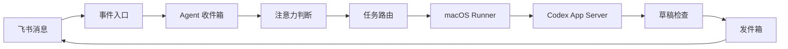

# Lark Agent

Lark Agent 是一个自托管的飞书消息 Agent 控制面。它通过飞书长连接接收消息，把信号送入 Agent 收件箱，再由固定绑定 `CODEX_HOME + profile` 的 macOS Runner 调用 Codex App Server 完成任务，并把回复发送回原私聊或群聊主消息流。

项目包含：

- Fastify + PostgreSQL 控制面，不依赖 Redis。
- React 运维后台，可查看消息、Signal、注意力判断、Codex、草稿和发件箱的完整数据流。
- 基于 `lark-cli event consume` 的飞书长连接，不要求公网事件回调地址。
- 动态管理多个飞书机器人，每个机器人使用独立凭据、消费者、角色、群绑定和 Codex 会话。
- GitLab Runner 式的一次性设备注册与 macOS `launchd` 常驻运行。
- 每个 Runner 固定绑定 Codex Home、profile 和一个或多个总工作区；每个机器人自动使用 `<总工作区>/<App ID>/` 专属子目录，任务不会静默迁移或跨机器人共享工作目录。
- CardKit 单消息流式回复、草稿新鲜度检查、幂等发件箱和故障诊断。

## 架构



## 要求

- Node.js 22 或更高版本，pnpm 11。
- Docker 与 Docker Compose。
- 飞书自建应用及 Bot 凭据。
- 运行 Runner 的 macOS，已安装并配置 Codex CLI。
- 可供目标 Mac 下载 Runner 产物的 HTTP(S) 地址。

## 本地启动

```bash
cp .env.example .env
pnpm install
pnpm build
docker compose up -d postgres control
```

如需由 Compose 暴露控制面端口：

```bash
docker compose -f compose.yaml -f compose.host.yaml up -d postgres control
```

控制台支持挂载在 HTTPS 子路径。将 `ADMIN_ORIGIN` 设置为完整公开地址（例如
`https://agent.example.internal/lark-agent`），并让反向代理把该路径前缀剥离后转发到 control；
同时传递 `X-Forwarded-Prefix: /lark-agent`。后台静态资源、API、SSE、身份确认链接和
Session Cookie 会保持在同一子路径内。

如需同时运行示例 Caddy 入口：

```bash
docker compose --profile proxy up -d
```

首次启用飞书前，使用 App Secret 初始化独立的 `lark-cli` volume：

```bash
pnpm init:lark-volume
```

该脚本只在初始化阶段读取 `.env` 中的 `BOT_APP_SECRET`。导入成功后可从私有 `.env` 删除
`OWNER_OPEN_ID`、`BOT_APP_ID`、`BOT_APP_SECRET` 和 `WHITELIST_CHAT_IDS`；机器人、主人及群绑定
以后以 PostgreSQL 和 lark-cli profile 为准，长期运行的 `control` 容器不接收 App Secret。

## 飞书配置

至少订阅 `im.message.receive_v1`，并为机器人配置读取与发送消息所需权限。流式回复还需要 `cardkit:card:write`。卡片按钮回调是可选能力，可通过 `LARK_CARD_ACTIONS_ENABLED` 单独启用。

私聊机器人发送：

```text
/帮助
/连接控制台
```

`/连接控制台` 会返回一条两分钟有效、只能使用一次的身份确认链接。后台只接受已在机器人配置中绑定为主人的飞书身份；`OWNER_OPEN_ID` 只用于空数据库首次引导。

## 添加和绑定机器人

首次启动会把 `.env` 与默认 `lark-cli` 身份导入为第一个机器人。之后在 HTTPS 控制台的
“机器人”页面添加其他飞书应用：App Secret 只写入服务器上权限为 `600` 的独立
`lark-cli` profile，不进入 PostgreSQL、API 响应或日志。添加后私聊对应机器人发送控制台生成的：

```text
/绑定控制台 <一次性代码>
```

再勾选该机器人可以处理的群，并按需设置角色提示词、默认执行器和默认总工作区。Runner 会在机器人首次执行任务时创建 `<总工作区>/<App ID>/`，并将它作为该机器人独立的 Codex 工作目录。群中明确
`@` 某个已注册机器人时只路由给被提及者；没有明确提及机器人的普通续聊会进入该群
所有活跃机器人各自的收件箱，由它们独立决定是否响应。已注册机器人的最终回复也按普通成员消息进入其他活跃机器人的收件箱；不会回灌给自己，也不会传播 commentary、审批或故障提示。由于飞书事件不会稳定推送普通机器人消息，这条链路由控制面在发件确认成功后按平台 `message_id` 幂等投递。

“机器人”页面可配置连续互聊的全局因果深度，默认 30 轮、范围 1–200。达到上限时当前回复仍会发送，但控制面停止继续传播，只在群内提示一次并等待人类消息；下一条人类消息会自动建立新的因果起点。角色与路由修改只影响新会话。

## 添加 Runner

在后台“执行器”页面生成一次性安装指令。指令会包含控制面地址、十分钟有效的注册令牌和 Runner 产物地址：

```bash
curl -fsSL 'https://cdn.example.com/lark-agent/runner/install.sh' \
  | /bin/zsh -s -- \
    --artifact-base 'https://cdn.example.com/lark-agent' \
    --server 'https://agent.example.com' \
    --token '<one-time-token>'
```

安装器支持 macOS Apple Silicon 和 Intel，默认发现 `~/.codex`，优先选择 `he` profile，并将当前目录作为第一个总工作区。机器人任务不会直接在总工作区根目录执行，而是在各自的 App ID 子目录中运行。安装后使用：

```bash
lark-agent-runner help
lark-agent-runner status <executor-id>
lark-agent-runner stop <executor-id>
lark-agent-runner start <executor-id>
lark-agent-runner logs <executor-id>
```

Runner 安装在 `~/Library/Application Support/Lark Agent Runner/`，设备凭据只保存在目标 Mac，控制面只保存哈希。

## 发布 Runner

发布机需要在环境中提供：

```text
RUNNER_ARTIFACT_PUBLIC_BASE_URL
RUNNER_ARTIFACT_RSYNC_TARGET
RUNNER_ARTIFACT_RSYNC_PASSWORD_FILE
```

密码文件必须为 `600`，不得提交到 Git；建议放在仓库已忽略的 `.private/rsync.pass`。先做本地构建：

```bash
pnpm publish:runner --dry-run
```

正式发布会先上传不可变版本产物，从 CDN 回读校验 SHA-256，最后才更新 `manifest.json`：

```bash
pnpm publish:runner
```

## 开发验证

```bash
pnpm check:public
pnpm typecheck
TEST_DATABASE_URL=postgresql://... pnpm test
pnpm build
docker compose --env-file .env.example config --quiet
```

## 安全

- `.env`、`.private/`、设备凭据、日志和构建产物均被 Git 忽略。
- 控制面不会保存 Runner 的本机绝对路径，只保存总工作区别名、机器人 App ID 与配置指纹。
- 飞书消息不能覆盖 Runner 的 `CODEX_HOME`、profile、总工作区或机器人专属子目录。
- 公开发布前运行 `pnpm check:public`，并建议额外使用 secret scanner 扫描。
- 生产部署应限制控制台、PostgreSQL、指标和 Runner CDN 的网络访问范围。

更多信息见 [SECURITY.md](SECURITY.md)。

## License

[MIT](LICENSE)
